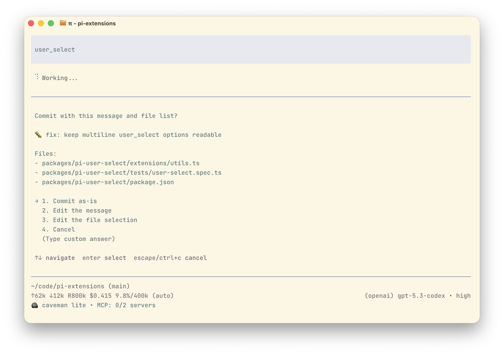

# @fgladisch/pi-user-select

Registers `user_select` tool so LLM (or skills) can ask human a multiple-choice
question.

Use when workflow needs explicit user input to disambiguate, confirm, or pick
between mutually exclusive paths instead of guessing.

## Install

```bash
pi install npm:@fgladisch/pi-user-select
```

No config, no slash commands.

## Example



## Tool schema

| Field         | Type       | Required | Description                                                   |
| ------------- | ---------- | -------- | ------------------------------------------------------------- |
| `question`    | `string`   | yes      | Question/prompt shown to user.                                |
| `options`     | `Option[]` | yes      | Mutually exclusive choices (`{ label, description? }`, ≥ 1).  |
| `allowCustom` | `boolean`  | no       | When `true`, append a "(Type custom answer)" free-text entry. |

Example:

```json
{
  "question": "Which package manager should I use?",
  "options": [
    { "label": "npm" },
    { "label": "pnpm", "description": "Faster, content-addressable" },
    { "label": "yarn" }
  ],
  "allowCustom": true
}
```

## Behavior

- **Interactive UI**: shows question, numbered options, a blank line before and
  after descriptions, descriptions indented by four spaces, and optional
  `(Type custom answer)` entry.
- **Non-interactive** (`pi -p`, JSON mode): throws so LLM sees error result
  and stops looping on tool that has no human to answer it.
- **Cancellation** (Esc / null / whitespace-only custom answer): returns
  non-error result with `answer: null` and `cancelled: true`.

Tool result text:

| Outcome           | `content[0].text`                       |
| ----------------- | --------------------------------------- |
| Pre-baked option  | `User selected: <n>. <label>`           |
| Free-text answer  | `User wrote: <trimmed text>`            |
| Cancelled         | `User cancelled the selection`          |
| Empty custom text | `User submitted an empty custom answer` |

`details` includes structured fields (`question`, `options`, `answer`,
`wasCustom`, `cancelled`) for renderers and downstream skills.

## Inter-extension events

The extension emits lifecycle events on `pi.events` so another extension can
mirror and answer prompts, while the local TUI remains active. The first valid
answer wins; when a remote answer wins, the open local dialog is dismissed. Late
responses return `{ accepted: false, reason: "already_resolved" }`. Listener
failures are ignored so the local UI remains the fallback.

| Event                                 | When it fires                                      |
| ------------------------------------- | -------------------------------------------------- |
| `pi-user-select:request`              | Before opening the local selection prompt.         |
| `pi-user-select:custom-input-request` | Before opening the local custom-answer input.      |
| `pi-user-select:resolved`             | After local or remote selection/cancellation wins. |
| `pi-user-select:error`                | When execution fails unexpectedly.                 |
| `pi-user-select:closed`               | When a request can no longer be answered.          |

Request events include a `respond(response)` callback. `pi-user-select:request`
accepts remote `{ source: "remote", kind: "select", optionIndex }`,
`{ source: "remote", kind: "custom", value }` when `allowCustom` is enabled, or
`{ source: "remote", kind: "cancel" }`. `pi-user-select:custom-input-request`
accepts `{ source: "remote", kind: "submit", value }` or
`{ source: "remote", kind: "cancel" }`.
